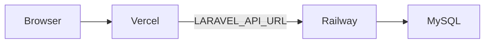

# Elevex

Internship management platform: Laravel API + Next.js dashboard.

## Stack

- **Backend:** Laravel (Sanctum SPA auth), MySQL/Postgres, DomPDF
- **Frontend:** Next.js App Router, TanStack Query, Tailwind, shadcn/ui

## Roles

| Role | Who creates them | Can do |
|------|------------------|--------|
| `super_admin` | Seeded | Everything + create admins |
| `admin` | Super admin | Onboard interns, projects/tasks, reviews, reports |
| `intern` | Admin onboard | Complete tasks, logbooks, request letters, sick days |

There is **no public signup**. Accounts are invite-only.

## Quick start

### Backend

```bash
cd backend
cp .env.example .env   # set DB + APP_URL=http://localhost:8000
composer install
php artisan key:generate
php artisan migrate --seed
php artisan storage:link
php artisan serve
```

Default seeded logins (password for all: `password`):

- Super admin: `superadmin@elevex.com`
- Admin: `admin@elevex.com`
- Test intern: `intern@elevex.com`
- Extra demo interns: `alice@elevex.com`, `brian@elevex.com`, `claire@elevex.com`, `david@elevex.com`, `eva@elevex.com`

Recalculate all performance scores anytime:

```bash
php artisan performance:recalculate
```

### Frontend

```bash
cd frontend
cp .env.example .env.local   # LARAVEL_API_URL=http://localhost:8000
npm install
npm run dev
```

Open [http://localhost:3000](http://localhost:3000). The Next.js `/api/*` proxy forwards to Laravel with cookies.

## Deploy (Vercel + Railway)

Elevex is two services. Do **not** run Laravel on Vercel or Cloudflare Workers.

| Piece | Platform | Notes |
|-------|----------|--------|
| Next.js frontend | **Vercel** | Root directory = `frontend` |
| Laravel API + MySQL | **Railway** | Root directory = `backend` (Docker) |
| Cloudflare | Optional DNS only | Point `app.` → Vercel, `api.` → Railway |



### 1. Railway (API)

1. Create a Railway project; add a **MySQL** plugin and a service from this repo.
2. Set the service **Root Directory** to `backend` (uses [`backend/Dockerfile`](backend/Dockerfile) + [`backend/railway.toml`](backend/railway.toml)).
3. Generate an app key locally: `cd backend && php artisan key:generate --show`.
4. Set variables (Variables tab):

| Variable | Example |
|----------|---------|
| `APP_ENV` | `production` |
| `APP_DEBUG` | `false` |
| `APP_KEY` | from `key:generate --show` |
| `APP_URL` | `https://<railway-public-domain>` |
| `SESSION_SECURE_COOKIE` | `true` |
| `SESSION_DOMAIN` | leave empty / unset |
| `FRONTEND_URL` | `https://<your-app>.vercel.app` (comma-separate custom domains) |
| `SANCTUM_STATEFUL_DOMAINS` | `<your-app>.vercel.app,app.yourdomain.com` (no `https://`) |
| `FILESYSTEM_DISK` | `public` |
| `RUN_SEED` | `true` on **first** deploy only, then remove |

MySQL: either link the plugin and rely on `MYSQLHOST` / `MYSQLDATABASE` / etc. (mapped in the entrypoint), or set `DB_HOST`, `DB_PORT`, `DB_DATABASE`, `DB_USERNAME`, `DB_PASSWORD` explicitly.

5. Optional: attach a **volume** at `/app/storage` so avatars and PDFs survive redeploys.
6. Deploy. Health check is `GET /up`. Confirm migrate/seed logs look clean.
7. Remove `RUN_SEED` after the first successful boot. Change seeded passwords immediately.

Production seed creates super admin / admin / test intern (+ skills, achievements, holidays). **DemoSeeder does not run** outside `local`.

### 2. Vercel (frontend)

1. Import the GitHub repo into Vercel.
2. Set **Root Directory** to `frontend`.
3. Environment variable:

| Variable | Value |
|----------|--------|
| `LARAVEL_API_URL` | `https://<your-railway-domain>` (no trailing slash) |

4. Deploy. Browser traffic stays on the Vercel origin; `/api/*` is proxied server-side to Laravel ([`frontend/app/api/[...path]/route.ts`](frontend/app/api/[...path]/route.ts)).

### 3. Cookie / Sanctum checklist

- Browser only talks to Vercel; cookies are set on the Vercel host via the proxy (`SESSION_DOMAIN` unset).
- `SANCTUM_STATEFUL_DOMAINS` must list every browser host (Vercel + custom), without scheme.
- `FRONTEND_URL` must list the same origins with `https://` for CORS.
- `APP_URL` must match the public Laravel URL Railway serves.
- After both are live: open the app → sign in as `superadmin@elevex.com` / `password` → confirm redirect to `/admin/dashboard`.

### 4. Optional custom domains

- `app.yourdomain.com` → Vercel; add that host to `SANCTUM_STATEFUL_DOMAINS` and `FRONTEND_URL`.
- `api.yourdomain.com` → Railway; set `APP_URL` to that HTTPS URL and update `LARAVEL_API_URL` on Vercel.

## Performance scores (0–100)

```
overall = completion×40% + deadlines×20% + consistency×15% + quality×15% + teamwork×10%
```

- Completion / deadlines come from tasks
- Consistency from **approved** logbooks vs working days
- Quality / teamwork from admin evaluations (1–5 scaled to %)

**Top performer** on the admin dashboard is simply the highest `overall_score`. A value like `22.1 / 100` is a real low score (often thin demo data), not a UI bug. Fresh `DemoSeeder` now seeds completed work + evaluations and runs recalculate so scores look more realistic.

## Key flows

1. Super admin creates admins → `/admin/admins`
2. Admin onboards intern (account + **active** internship) → `/admin/interns/new`
3. Admin assigns projects/tasks → intern completes + submits logbooks
4. Admin reviews logbooks / sick days / evaluations
5. Recommendation drafts auto-generate from metrics → admin edits → approve PDF

## Phase status

Frontend Phase 11 modules are implemented through Settings/Polish and Final QA (this README). Use the in-app nav for the live surface area.
